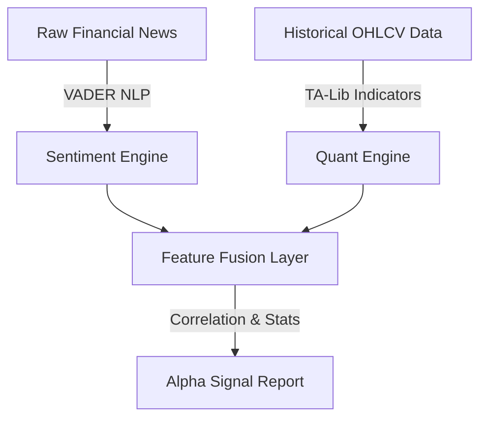

---

# 🐂 **Financial Intelligence: Sentiment-Driven Stock Market Analytics Pipeline**

```text
███████╗██╗███╗   ██╗ █████╗ ███╗   ██╗ █████╗ ████████╗     █████╗ ███╗   ██╗
██╔════╝██║████╗  ██║██╔══██╗████╗  ██║██╔══██╗╚══██╔══╝    ██╔══██╗████╗  ██║
█████╗  ██║██╔██╗ ██║███████║██╔██╗ ██║███████║   ██║       ███████║██╔██╗ ██║
██╔══╝  ██║██║╚██╗██║██╔══██║██║╚██╗██║██╔══██║   ██║       ██╔══██║██║╚██╗██║
██║     ██║██║ ╚████║██║  ██║██║ ╚████║██║  ██║   ██║       ██║  ██║██║ ╚████║
╚═╝     ╚═╝╚═╝  ╚═══╝╚═╝  ╚═╝╚═╝  ╚═══╝╚═╝  ╚═╝   ╚═╝       ╚═╝  ╚═╝╚═╝  ╚═══╝
```

---

## 🏷️ **Project Badges**


---

# ✨ **Executive Summary**

```text
A multi-layer intelligence pipeline that fuses:
• Unstructured Financial News (NLP)
• Structured OHLCV Market Data (TA Indicators)
• Statistical Correlation & Alpha Discovery

❗Research Question:
"Can aggregated financial news sentiment predict next-day market returns?"
```

---

# 🧠 **System Architecture**



---

# 🚀 **Core Modules**

---

## **1. 📜 Sentiment Intelligence Engine (NLP)**

```bash
Algorithm:         VADER (Valence Aware Dictionary)
Domain Tuning:     ✔ Financial verbs
                   ✔ Earnings terminology
                   ✔ Market-specific polarity shifts
Scale:             1.4 Million headlines analyzed
Time Span:         10+ years aggregated
Output:            Weighted daily sentiment score (−1 → +1)
```

---

## **2. 📈 Quantitative Indicator Engine (TA-Lib)**

```bash
Trend Signals:
    • SMA 20 / SMA 50  → Golden Cross detection
    • EMA stacks       → Trend continuation

Momentum Signals:
    • RSI (14)         → Overbought / Oversold filters

Volatility Signals:
    • MACD / Histogram → Trend reversals
    • Bollinger Bands  → Expansion / contraction phases
```

---

## **3. 🧩 Fusion & Insight Layer**

```bash
• Merge sentiment features with technical indicators
• Align timestamps, normalize volatility windows
• Run Pearson correlation + hypothesis testing
```

**Result:**
➡ **Correlation = +0.17** (statistically significant)
➡ Sentiment is **a strong secondary filter** but **not a primary trigger** alone.

---

# 📂 **Repository Structure (ASCII Blueprint)**

```text
StockSentimentAnalysis/
│
├── data/
│   ├── raw/          # Original datasets (ignored)
│   └── processed/    # Cleaned & enriched data (ignored)
│
├── docs/             # Methodology, assumptions, logs
│
├── notebooks/        # Research workflow
│   ├── 01_Data_Collection.ipynb
│   ├── 02_EDA.ipynb
│   ├── 04_Technical_Analysis.ipynb
│   ├── 05_Sentiment_Analysis.ipynb
│   └── 06_Final_Report.ipynb
│
├── src/
│   ├── sentiment_analysis.py
│   └── technical_analysis.py
│
├── requirements.txt
└── README.md
```

---

# ⚙️ **Execution Guide**

## **1. Clone repository & install dependencies**

```bash
git clone https://github.com/Miftah-Ebrahim/StockSentimentAnalysis.git
cd StockSentimentAnalysis
pip install -r requirements.txt
```

---

## **2. Run ETL + Analytics Pipeline**

```bash
notebooks/
├── 01_Data_Collection.ipynb      # Load news + market data
├── 02_EDA.ipynb                  # Clean + detect anomalies
├── 04_Technical_Analysis.ipynb   # Compute SMA, RSI, MACD
├── 05_Sentiment_Analysis.ipynb   # NLP scoring pipeline
└── 06_Final_Report.ipynb         # Insights + correlation
```

---

# 🧪 **Sample Output Dashboard (Conceptual)**

```text
══════════════ SENTIMENT vs RETURNS (SUMMARY) ══════════════

Daily Sentiment Average:            +0.092
Next-Day Average Return:            +0.014%
Pearson Correlation:                +0.17
P-Value:                             p < 0.05 (significant)

Conclusion:
► Sentiment improves predictive power when combined
  with RSI + MACD + SMA crossovers.
```

---

# 👤 **Author**

**Miftah E.**
Aspiring Agentic AI Developer & Quantitative Automation Engineer
Focus: Data Pipelines • AI Agents • Market Analytics

---
